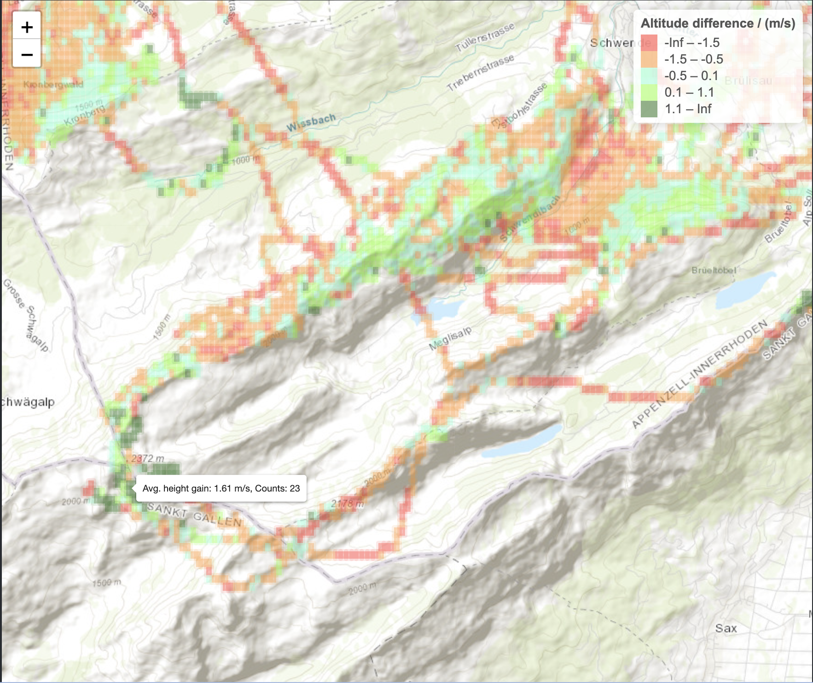

# Paragliding Tracker and Visualization (R)

## Table of Contents
1. [Introduction](#1-introduction)
2. [Prerequisites and Setup](#2-prerequisites-and-setup)
   - [Necessary Software and Packages](#necessary-software-and-packages)
   - [Setting Up the Environment](#setting-up-the-environment)
3. [Script Overview](#3-script-overview)
   - [General Description](#general-description)
   - [Main Functions and Their Roles](#main-functions-and-their-roles)
4. [Function Descriptions](#4-function-descriptions)
   - [File: "1_LoadData.R"](#file-1_loaddatar)
   - [File: "2_ThermalsApp.R"](#file-2_thermalsappr)
5. [Usage Instructions](#5-usage-instructions)
   - [Overview](#overview)
   - [Getting Started](#getting-started)
   - [Running the First Script (1_LoadData.R)](#running-the-first-script-1_loaddatar)
   - [Running the Second Script (2_ThermalsApp.R)](#running-the-second-script-2_thermalsappr)
   - [Interacting with the Shiny App](#interacting-with-the-shiny-app)
   - [Troubleshooting](#troubleshooting)
6. [Examples and Screenshots](#6-examples-and-screenshots)
   - [Example: Data Extraction and Processing](#example-data-extraction-and-processing)
   - [Example: Visualization with Shiny](#example-visualization-with-shiny)
   - [Screenshots](#screenshots)
   - [Conclusion](#conclusion)
7. [Troubleshooting and FAQs](#7-troubleshooting-and-faqs)
8. [Contributing](#8-contributing)
9. [License](#9-license)
10. [Contact Information](#10-contact-information)
11. [Shoutouts](#11-shoutouts)


## 1. Introduction

This R script is developed to analyze and visualize paragliding flight data, e.g. from Skytraxx variometer records. It processes data sets including altitude, longitude, and latitude, offering useful analytics to understand paragliding patterns and behaviors.

At its core, the script extracts and converts geographic coordinates and altitude data from IGC paragliding records. This foundational step leads to further analyses such as calculating average altitude differences and identifying lift or sinking trends in paragliding flights.

The script utilizes R libraries like `dplyr` for data handling, `ggplot2` and `leaflet` for visualization, and `shiny` for building an interactive web application. These libraries facilitate efficient data processing and help in presenting the data in an accessible and visually clear manner.

A notable function, `extract_lat_lon_alt`, interprets `igc` file data into longitudes and latitudes. For example, in a format like "B1408474717490N00919583EA0151301624", segments `2:7` represent the flight time, `8:9` are the latitude degrees, `10:14` the latitude minutes, `16:18` the longitude degrees, and `19:23` the longitude minutes. The altitude is encoded in the segment `32:35`.

Additionally, the `read_igc_files` function processes multiple flight records, aggregates data, and prepares it for in-depth analysis. It involves discretizing geographic coordinates and calculating mean altitude differences for each grid cell, aiding in the identification of thermals and sink areas.

The script ultimately powers a Shiny application, utilizing the processed data to generate an interactive heatmap. This visual tool aids in making the data approachable and offers insights into paragliding dynamics, such as pinpointing areas of lift and sink, valuable for both new and seasoned paragliders.




## 2. Prerequisites and Setup

### Necessary Software and Packages

To run the Paragliding Data Analysis script effectively, you will need to have R installed on your system. R is a free software environment for statistical computing and graphics. You can download it from [CRAN](https://cran.r-project.org/), the Comprehensive R Archive Network.

Once R is installed, several additional packages are required for the script to function correctly. These packages are essential for data manipulation, visualization, and the creation of a web-based interface. The required packages are:

- `ggplot2`: A system for declaratively creating graphics, based on The Grammar of Graphics.
- `ggmap`: A package that allows for the visualization of spatial data and models on top of static maps.
- `sf`: Simple Features for R, a package that supports simple features, a standardized way to encode spatial vector data.
- `dplyr`: A grammar of data manipulation, providing a consistent set of verbs that help you solve the most common data manipulation challenges.
- `shiny`: An R package that makes it easy to build interactive web applications (apps) straight from R.
- `leaflet`: An open-source JavaScript library for mobile-friendly interactive maps. R interface to Leaflet.
- `shinythemes`: Provides standard Bootstrap themes for Shiny.
- `leaflet.extras`: Extra functionality for the leaflet package in R, providing additional functions for interactive maps.

### Setting Up the Environment

To set up your environment for running the script, follow these steps:

1. **Install R**: 
   - Download and install R from the [CRAN website](https://cran.r-project.org/).

2. **Install Required Packages**:
   - Open R and run the following command to install the necessary packages:

    ```R
    install.packages(c("ggplot2", "ggmap", "sf", "dplyr", "shiny", "leaflet", "shinythemes", "leaflet.extras"))
    ```

3. **Load Libraries**:
   - Once the packages are installed, you can load them into your R environment using the `library` function. This is typically done at the beginning of your R script as shown:

    ```R
    library(dplyr)
    library(ggplot2)
    library(shiny)
    library(sf)
    library(leaflet)
    library(shinythemes)
    library(leaflet.extras)
    ```

This setup ensures that all necessary tools and packages are installed and loaded, preparing the R environment for running the Paragliding Data Analysis script. With these steps completed, you can proceed to run the script to analyze your paragliding data.
   
   
   

## 3. Script Overview

### General Description

The provided R scripts, "1_LoadData.R" and "2_ThermalsApp.R", constitute a comprehensive framework designed for the analysis of paragliding flight data. These scripts extract, process, and visualize data obtained from the Skytraxx variometer, focusing primarily on latitude, longitude, and altitude information. The analysis revolves around identifying thermal activities and calculating the rate of altitude change (lift or sinking) experienced by paragliders.

### Main Functions and Their Roles

1. **Data Extraction and Transformation (`1_LoadData.R`):**
   - **Function `extract_lat_lon_alt`**: This function is pivotal in parsing individual IGC paragliding records. It extracts latitude, longitude, and altitude from these records, performing necessary conversions and adjustments (like correcting for hemisphere differences) to prepare the data for analysis.
   - **Function `read_igc_files`**: It handles the bulk of the data processing. This function reads multiple IGC files from a directory, extracts the coordinates from each file using `extract_lat_lon_alt`, and then consolidates this data into a single data frame. Notably, it includes calculations for altitude differences, filtering of data based on altitude change criteria, discretization of latitude and longitude (for rasterization), and computation of mean altitude differences and counts for each grid cell. This prepares a detailed dataset representing the altitude changes at different coordinates.

2. **Data Visualization and Application (`2_ThermalsApp.R`):**
   - **Data Preparation for Visualization**: Before initializing the Shiny application, the script processes the data frame obtained from `read_igc_files`. It calculates grid boundaries and labels for altitude differences and prepares a color palette for visualization based on altitude differences.
   - **Shiny Application (`server` function)**: This section outlines the server logic for a Shiny app. It includes the creation of a heatmap to visualize the thermal activities. The heatmap uses rectangles to represent grid cells, colored according to the altitude difference. This visualization is enhanced with labels and legends, providing an interactive and informative map of thermal activities.
   - **Launching the Shiny App**: The script concludes with the initiation of the Shiny application, which serves as an interactive platform for users to explore and understand the thermal activities based on the analyzed flight data.


## 4. Function Descriptions

---

### File: "1_LoadData.R"

### `extract_lat_lon_alt` Function

- **Purpose**: This function is designed to extract and convert latitude, longitude, and altitude data from individual IGC paragliding records obtained from the Skytraxx variometer. It plays a pivotal role in decoding the raw data into a structured format for further analysis.

- **Input**: A single record string from an IGC file.
- **Output**: A data frame containing the latitude, longitude, and altitude values derived from the input record.

- **Logic and Algorithms**: 
  - **Latitude and Longitude Extraction**: The function parses specific substrings of the record to extract degrees and minutes for both latitude and longitude. It then converts these values into decimal degrees.
  - **Hemisphere Adjustment**: It adjusts the latitude and longitude based on the hemisphere indicators ('S' for South, 'W' for West) by negating the values if necessary.
  - **Altitude Extraction**: Altitude is extracted from a predefined position in the string and directly converted to a numeric value.
  - **Data Aggregation**: The extracted values are combined into a data frame, providing a structured representation of the coordinate and altitude data.

### `read_igc_files` Function

- **Purpose**: This function is responsible for processing multiple IGC files from a specified directory. It aggregates the data to identify areas with significant altitude changes, which could indicate thermal lift or sinking air - key elements in paragliding.

- **Input**: The directory path containing IGC files.
- **Output**: An aggregated data frame that summarizes the average altitude differences and counts for each grid cell.

- **Logic and Algorithms**: 
  - **File Processing**: The function lists all IGC files in the given directory and processes each file individually.
  - **Coordinate Extraction**: It applies `extract_lat_lon_alt` to each line in a file that starts with 'B' (indicating a fix data record in IGC format), thereby extracting the coordinates.
  - **Altitude Difference Calculation**: The function calculates the difference in altitude between successive records.
  - **Data Filtering**: Only records with altitude differences within a specified range are retained.
  - **Discretization**: Latitude and longitude values are discretized to a fixed precision.
  - **Data Aggregation**: The function aggregates data to calculate the mean altitude difference and count for each discretized latitude-longitude pair.

---

### File: "2_ThermalsApp.R"

### Shiny App Server Logic

- **Purpose**: This part of the script defines the server logic for a Shiny application, which visualizes the data on a heatmap. The app helps in identifying regions with significant thermal activity, as indicated by the altitude differences.

- **Logic and Algorithms**: 
  - **Grid Calculation**: It calculates boundaries for each grid cell based on the discretized latitude and longitude.
  - **Label Creation**: Labels are generated to display average height gain and count for each grid cell.
  - **Color Palette**: A continuous color palette is created to visually represent different ranges of altitude differences.
  - **Heatmap Generation**: Rectangles representing grid cells are added to a leaflet map with colors indicating altitude differences.
  - **Legend and View Setting**: The script includes a legend and sets the initial view of the map based on the geographic extent of the data.


## 5. Usage Instructions

### Overview
The provided R scripts, "1_LoadData.R" and "2_ThermalsApp.R", are designed for analyzing paragliding data from Skytraxx variometer devices. The first script handles data extraction, transformation, and preprocessing, while the second script visualizes this data in a Shiny application.

### Getting Started
To use these scripts effectively, follow these steps:

1. **Environment Setup**:
   - Ensure R is installed on your system. If not, download and install it from [CRAN](https://cran.r-project.org/).
   - Open RStudio or any R environment of your choice.

2. **Install Required Packages**:
   - Run the following command in your R console to install the necessary packages:
     ```R
     install.packages(c("ggplot2", "ggmap", "sf", "dplyr", "shiny", "leaflet", "shinythemes"))
     ```

### Running the First Script (1_LoadData.R)
1. **Data Preparation**:
   - Ensure your Skytraxx variometer data is in the IGC file format and placed in an accessible directory.

2. **Modify Script Parameters**:
   - In the `read_igc_files` function, change the `directory` parameter to the path where your IGC files are stored.

3. **Execute Script**:
   - Run the `1_LoadData.R` script. This will process the IGC files and generate a data frame containing latitude, longitude, and altitude data, along with other calculated metrics.

### Running the Second Script (2_ThermalsApp.R)
1. **Data Input**:
   - The script expects a pre-processed data frame from `1_LoadData.R`. Make sure this data is available.

2. **Configure File Paths**:
   - Modify the file paths in the script to point to your processed data and desired save location for the `thermals_data.RData` file.

3. **Launch Shiny App**:
   - Run the `2_ThermalsApp.R` script to start the Shiny application. This app visualizes the thermal data on a map, allowing you to interact with the data.

### Interacting with the Shiny App
- Once the app is running, you can:
  - View thermal data as a heatmap overlay on the map.
  - Interact with the map to zoom in/out and explore different areas.
  - Use the legend to understand the altitude differences represented by various colors, such as the number of seconds you've spent in each raster tile.

### Troubleshooting
- Ensure all file paths are correctly set to your local directories.
- Check if all required packages are installed and loaded.

Following these steps will allow you to fully utilize the capabilities of the R scripts for analyzing and visualizing paragliding data from Skytraxx variometer devices.


## 6. Examples and Screenshots

### Example: Data Extraction and Processing

**Input Data**:
- IGC files containing raw data from paragliding flights, in my case with the following format:
  B1645453303420S06036818WA011760117600000, where 
- Each file includes records of latitude, longitude, and altitude.

**Processing Steps**:
1. **Extract Coordinates**: The script parses the IGC files, extracting the latitude, longitude, and altitude. This is done using the `extract_lat_lon_alt` function.
2. **Analyze Flight Data**: It then processes these coordinates, filtering and discretizing them for further analysis. This includes computing the altitude difference and grouping data into grid cells.
3. **Aggregate Data**: Finally, the script aggregates this data, calculating the mean altitude difference and counts for each grid cell.

**Output**:
- A data frame (`df`) that contains the processed and aggregated flight data, ready for visualization.

### Example: Visualization with Shiny

**Shiny App Functionality**:
- The `2_ThermalsApp.R` script creates a Shiny application to visualize the processed data.
- It displays a heatmap representing the average altitude gain and frequency of occurrence in different geographical areas.

**Steps for Visualization**:
1. **Prepare Data for Heatmap**: The script calculates grid boundaries and prepares labels for each cell.
2. **Create Heatmap**: Utilizing Leaflet, a heatmap is generated. It shows the average height gain and count for each grid cell, using a color-coded scheme.
3. **Interactive Map**: The Shiny app provides an interactive map where users can explore different regions and see the thermal activities.

### Screenshots:


### Conclusion

These examples and the described screenshots demonstrate the script's ability to transform raw flight data into insightful visualizations. By analyzing and visualizing the altitude differences and frequencies of paragliding thermals, the script provides valuable insights for paragliders and researchers interested in flight patterns and thermal activities.
   
   
   
   


## 7. Troubleshooting and FAQs

### Troubleshooting

1. **Package Installation and Loading Issues:**
   - **Problem:** Difficulty in installing or loading required R packages.
   - **Solution:** Ensure you have an active internet connection and correct permissions. If a package fails to load, try reinstalling it.

2. **Function Execution Errors:**
   - **Problem:** Errors when executing functions like `extract_lat_lon_alt` or `read_igc_files`.
   - **Solution:** Check the format of the input data. The script expects specific data structures, so any deviation might cause errors.

3. **Data Frame Manipulation:**
   - **Problem:** Issues with data frame operations, particularly when aggregating or filtering data.
   - **Solution:** Verify the data frame's structure and ensure that column names and data types are as expected.

4. **Shiny App Not Running:**
   - **Problem:** The Shiny app (`2_ThermalsApp.R`) does not start or crashes.
   - **Solution:** Ensure all dependencies are correctly installed. Check for any syntax errors or missing variables in the script.

### FAQs


1. **Q: How does the script handle different hemispheres in coordinate data?**
   - A: The script adjusts the sign of latitude and longitude based on the hemisphere. For example, it assigns a negative value for coordinates in the Southern and Western Hemispheres.

2. **Q: What is the significance of filtering altitude differences in `read_igc_files`?**
   - A: This filter is used to isolate significant changes in altitude, which are indicative of thermal lifts or sinks, important for paragliding analysis.

3. **Q: Why are latitude and longitude values discretized?**
   - A: Discretization simplifies the analysis by grouping nearby points into the same grid cell, which is useful for visualizing and analyzing spatial data patterns.

4. **Q: Can I modify the grid size in the Shiny app for different analyses?**
   - A: Yes, the grid size can be adjusted based on the level of detail required. However, be aware that smaller grid sizes may increase computation time and memory usage.

5. **Q: What should I do if the color palette in the Shiny app is not displaying correctly?**
   - A: Ensure that the `colorBin` function's parameters are set correctly and that the data passed to it falls within the specified domain.


## 8. Contributing

The Paragliding data analysis script is an evolving project, and contributions from the community are highly valued. Whether it's improving the code, refining the data analysis methods, or enhancing the user interface, your input can make a significant difference. Here are some guidelines for contributing:

- **Familiarize Yourself with the Project:** Start by understanding the existing code and its functionalities. The two main files, "1_LoadData.R" and "2_ThermalsApp.R," form the core of the project, handling data extraction, transformation, and visualization respectively.
  
- **Identify Areas for Improvement:** While reviewing the code, look for areas that can be enhanced. It could be optimizing the data processing functions, adding new features to the Shiny app, or improving the visualization aspects.

- **Follow Best Practices:** When making changes, ensure that your code is clean, well-documented, and follows best programming practices. This makes it easier for others to understand and further improve upon your work.

- **Test Your Changes:** Before submitting your contribution, thoroughly test your changes to ensure they are working correctly and do not introduce new issues.

- **Submit a Pull Request:** Once you are satisfied with your enhancements, submit a pull request with a clear description of your changes and the benefits they bring to the project.

Your contributions are not only a means to improve the project but also an opportunity to collaborate and learn from others in the community.

## 9. License

This igc data analysis script is released under the MIT License. This license permits anyone to use, modify, and distribute the code, both in private and commercial settings.

## 10. Contact Information

For any queries, feedback, or discussions related to the igc data analysis script, feel free to reach out. Whether it's a technical question, a suggestion, or a request for collaboration, your input is welcomed. You can contact me using LinkedIn. 

## 11. Shoutouts

The Paragliding Thermal Maps Project by M. von Känel inspired me to do something similar but lightweight using only personal data. Anyway, please visit his awesome project [https://thermal.kk7.ch](https://thermal.kk7.ch) and support him.
